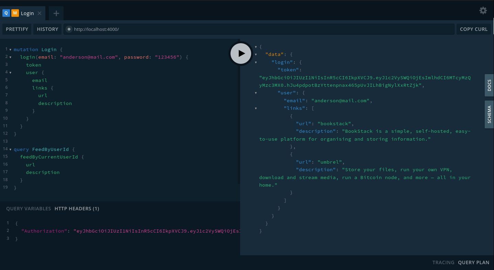
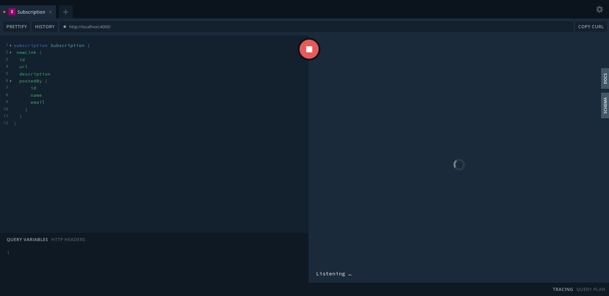
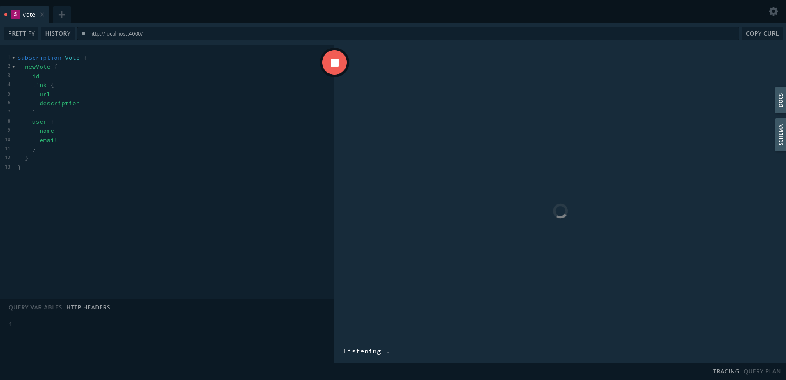

# Build a GraphQL Apollo Server with Node.js, Prisma, and SQLite

### Sample Mutation and Query



### Sample Listeners




## BASH Commands

```bash
  yarn init
  yarn add apollo-server@^2 graphql@^14.6.0
  yarn add  prisma -D
  yarn add @prisma/client
  npx prisma init
  npx prisma migrate dev
  npx prisma generate
  npx prisma studio
  yarn add bcryptjs
  yarn add jsonwebtoken
  npx prisma migrate dev --name "add-user-model"
  npx prisma migrate dev --name "add-vote-model"
  npx prisma generate
```

## Queries, Mutations ans Subscriptions

```graphql
mutation CreateData {
  post(url: "__URL__", description: "__DESCRIPTION__") {
    id
    description
    url
  }
}

# HTTP Headers
{
  "Authorization": "Bearer __TOKEN__"
}

# Return Data Feed

query ReturnData {
  feed {
    id
    description
    url
  }
}

# Return Data Feed Filtered

query ReturnFilteredData {
  feed(filter: "__FILTER__") {
    id
    description
    url
    postedBy {
      id
      name
    }
  }
}

# Return Data Feed Filtered and With Pagination

query ReturnFilteredAndPaginationData {
  feed(filter: "__FILTER__", skip: 1, take: 1) {
    id
    description
    url
    postedBy {
      id
      name
    }
  }
}

# Return Data Feed Filtered, With Pagination and Sorted

query ReturnFilteredAndPaginationAndSortedData {
  feed(filter: "", skip: 2, take: 2, orderBy: {description: asc}) {
    id
    description
    url
    postedBy {
      id
      name
    }
  }
}


# SignUp

mutation SignUp {
  signup(name: "__NAME__", email: "__EMAIL__", password: "__PASSWORD__") {
    token
    user {
      id
      name
    }
  }
}

# Login

mutation Login {
  login(email: "__EMAIL__", password: "__PASSWORD__") {
    token
    user {
      email
      links {
        url
        description
      }
    }
  }
}

# Return Feed Data By User ID

query FeedByUserId {
  feedByCurrentUserId {
    url
    description
  }
}

# HTTP Headers
{
  "Authorization": "Bearer __TOKEN__"
}

# Vote By Link ID

mutation Vote {
  vote(linkId: "__LINK_ID__") {
    link {
      url
      description
    }
    user {
      name
      email
    }
  }
}

# HTTP Headers
{
  "Authorization": "Bearer __TOKEN__"
}

# Subscription To Link (Listener)

subscription Link {
  newLink {
    id
    url
    description
    postedBy {
      id
      name
      email
    }
  }
}

# Subscription To Vote (Listener)

subscription Vote {
  newVote {
    id
    link {
      url
      description
    }
    user {
      name
      email
    }
  }
}
```

- [Video Link - Pt. 1](https://www.youtube.com/watch?v=YQ8CZoGjxD0)
- [Video Link - Pt. 2](https://www.youtube.com/watch?v=Hljmp4IrYN8)
- [Video Link - Pt. 3](https://www.youtube.com/watch?v=uLRpnGbSR5A)
- [Video Link - Pt. 4](https://www.youtube.com/watch?v=yUBaIjNAKLw)
